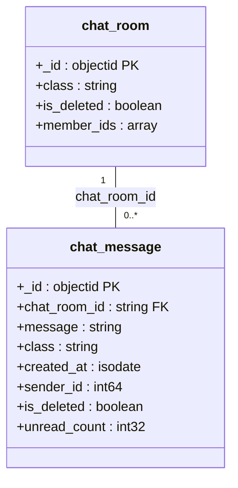
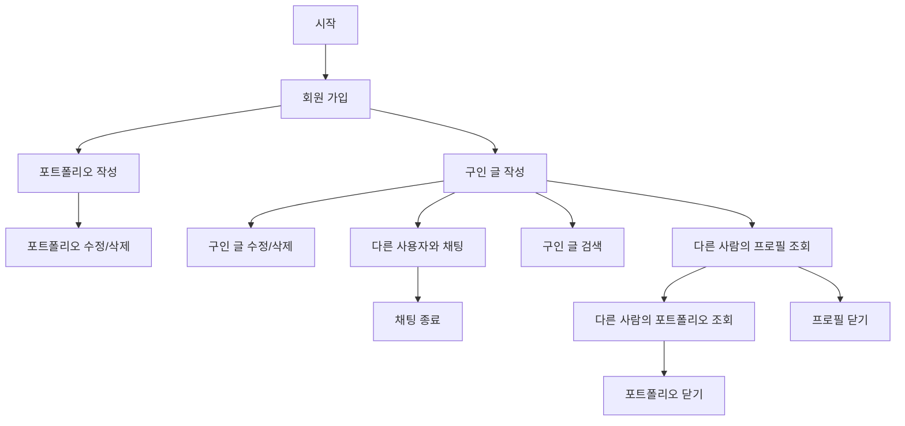

# Project `TapToon`: 웹툰 창작의 꿈을 잇다

[//]: # ()
[//]: # ()
[//]: # ()

 

 

* [프로젝트 개요](#프로젝트-개요)
* [프로젝트 사용 흐름](#프로젝트-사용-흐름)
* [이용 방법](#이용-방법)
* [프로젝트 구조](#프로젝트-구조)
* [기능 목록](#기능-목록)
* [Support](#support)

## 프로젝트 개요
웹툰 작가와 글 작가를 연결하는 매칭 플랫폼입니다.
아이디어만 있다면 그림 작가를, 뛰어난 그림 실력을 갖췄다면 글 작가를 찾아보세요!
당신의 재능을 마음껏 뽐내고, 최고의 파트너와 함께 새로운 이야기를 만들어 보세요. 🚀

### 작업 기간
***2025.02.10 - 2025.03.16***

## 📚 Used Stacks

 

  
  
  
   
  
  
  
  
   

  
  
  
   

  
  
  
   

  
  
  
   

  
  
  
   

  
  
  
   

  
  
  
  
   

  
   

## 🏰️ 프로젝트 구조

### 𓊍 프로젝트 아키텍처

### ⛁ ERD (RDMBS)

[//]: # (![Image]&#40;https://github.com/user-attachments/assets/7f7382d3-ebf3-4040-80bb-3311350545d8&#41;)

```mermaid
```mermaid
erDiagram
    member ||--o{ portfolio : owner_id
    member ||--o{ refresh_token : member_id
    member ||--o{ matching_post : user_id
    member ||--o{ comment : member_id
    
    category ||--o{ matching_post : category_id
    
    portfolio ||--o{ portfolio_file : portfolio_id
    
    matching_post ||--o{ matching_post_image : matching_post_id
    matching_post ||--o{ comment : matching_post_id
    
    comment ||--o{ comment : parent_id

    %% 엔터티 정의
    member {
        bigint id PK
        bit is_deleted
        datetime created_at
        datetime updated_at
        varchar email
        varchar name
        varchar nickname
        varchar password
        bigint provider_id
        enum grade "basic, plus, pro"
        enum provider "naver, google"
    }
    
    category {
        bigint id PK
        bigint member_id FK
        enum genre "fantasy, romance, comic, thriller, action, drama"
    }
    
    portfolio {
        bigint id PK
        bigint owner_id FK
        datetime created_at
        datetime updated_at
        text content
        varchar title
        enum status "pending, registered, deleting, deleted"
    }
    
    portfolio_file {
        bigint id PK
        bigint portfolio_id FK
        datetime created_at
        datetime updated_at
        varchar file_url
        varchar thumbnail_url
        varchar file_name
        enum file_type "pending, registered, deleted"
    }
    
    refresh_token {
        bigint id PK
        bigint member_id FK
        datetime created_at
        datetime expires_at
        datetime updated_at
        varchar device_info
        varchar token
    }
    
    matching_post {
        bigint id PK
        bigint user_id FK
        datetime created_at
        bigint view_count
        varchar description
        varchar file_url
        varchar title
        enum artist_type "writer, illustrator"
        enum status "pending, registered, deleted"
        enum work_type "online, offline, hybrid"
    }
    
    matching_post_image {
        bigint id PK
        bigint matching_post_id FK
        datetime created_at
        varchar original_image_url
        varchar thumbnail_image_url
        varchar file_name
        enum status "pending, deleted"
    }
    
    comment {
        bigint id PK
        bigint matching_post_id FK
        bigint member_id FK
        bigint parent_id FK
        bit is_deleted
        datetime created_at
        text content
    }
```

### MongoDB Schema

[//]: # ()

### 🔁 프로젝트 사용 흐름

## 🧩 API 명세서
[👉 API 명세서 바로가기](https://api.taptoon.site/swagger-ui/index.html)

## 이용 방법

### 1. 회원가입

* 사용자는 일반 로그인, 소셜 로그인을 선택하여 회원가입 또는 로그인 할 수 있습니다.
* 사용자는 마이 페이지에서 본인의 닉네임, 비밀번호를 수정할 수 있습니다.
* 소셜 로그인으로 가입 한 사용자에 한하여 최초 1회 이메일과 비밀번호를 설정할 수 있습니다.
  * 이메일과 비밀번호를 모두 설정하면 일반 로그인도 가능합니다.
  * 이메일은 최초 1회 바꾼 후에는 수정이 불가능합니다.
  * 닉네임을 수정하지 않으면 "null"으로 표시됩니다.
* 사용자가 로그인을 해야 다른 기능을 사용할 수 있습니다.
* 닉네임이나 이름으로 사용자 검색이 가능합니다.(완벽하게 일치해야 검색 가능)

### 2. 검색

### 포트폴리오
* 사용자는 마이 페이지에서 개인의 역량을 나타낼 수 있는 포트폴리오를 작성할 수 있습니다.
* 포트폴리오는 글, 그림 모두 가능합니다.
* 포트폴리오는 최대 5개 까지 작성 가능합니다.(이상은 VIP 서비스 예정)
* 포트폴리오에 이미지는 최대 3개까지만 첨부할 수 있습니다.

### 구인 글
* 사용자는 원하는 파트너를 구인하는 글을 작성할 수 있습니다.
* 구인하는 글에는 본인을 간략히 나타낼 만한 그림/글을 첨부할 수 있습니다.
* 구인하는 글의 제목이나 내용으로 검색할 수 있습니다.
  * 구인 글 검색은 자동완성 기능을 지원합니다.
  * 구인 글은 여러 조건으로 검색이 가능합니다.

### 채팅
* 사용자는 원하는 파트너와 컨택하기 위해 채팅을 진행할 수 있습니다.
* 채팅은 1:1 채팅, 그룹 채팅 모두 가능합니다.
* 채팅의 읽음 여부도 확인할 수 있습니다.

## 기능 목록
* 인증/인가
  * 소셜 로그인
  * security
* 이미지 등록
* 채팅
* 검색

## Dev log
* [📌 Elasticsearch 클러스터링 적용기 🚀](/devlog/강성욱/elasticsearch_고가용성을_위한_클러스터링_적용기.md)
* [📌 Elasticsearch 적용기 🚀](/devlog/강성욱/elasticsearch_고군분투_적용기.md)
* [📌 조회수 동시성 문제 해결 여정 🚀](/devlog/강성욱/조회수_동시성_문제_해결_여정.md)
* [📌 인덱스 최적화로 검색 API 성능 개선하기 🚀](/devlog/강성욱/인덱스를_활용한_검색_속도_향상_여정.md)
* [📌 CI/CD 개발노트 🚀](devlog/김창현/개발노트-CI,CD.md)
* [📌 이미지 개발노트 🚀](devlog/김창현/개발노트-이미지.md)
* [📌 인증/인가 개발노트 🚀](devlog/김창현/개발노트-인증,인가.md)

## Developed by
<table>
  <tr>
    <td align="center">
      <b><a href="https://github.com/chk223">김창현</a></b> 
       
      <b>팀장</b>
    </td>
    <td align="center">
      <b><a href="https://github.com/freedrawing">강성욱</a></b> 
       
      <b>부팀장</b>
    </td>
    <td align="center">
      <b><a href="https://github.com/leithharbor">이상구</a></b> 
       
      <b>팀원</b>
    </td>
    <td align="center">
      <b><a href="https://github.com/dllll2">이진영</a></b> 
       
      <b>팀원</b>
    </td>
  </tr>
</table>
