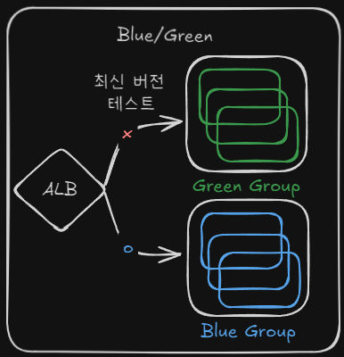
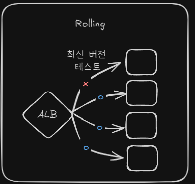
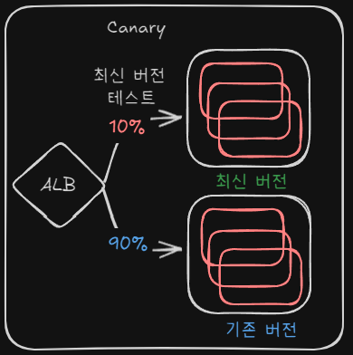
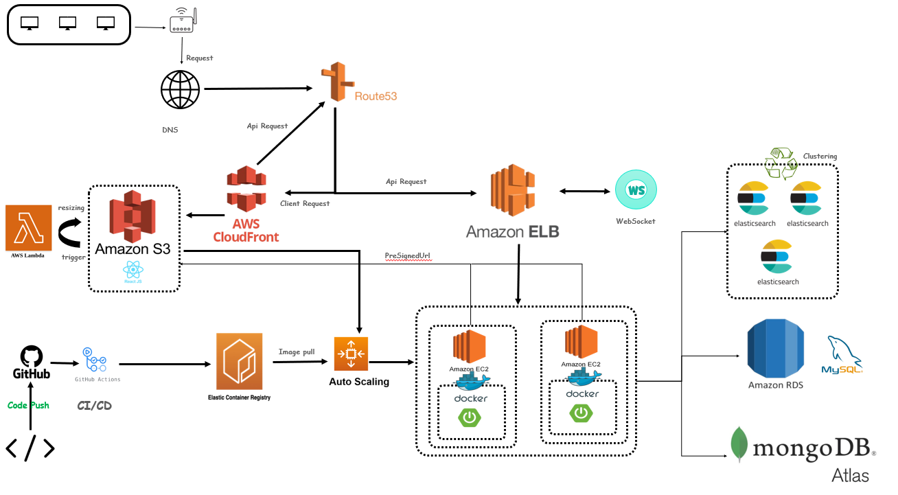
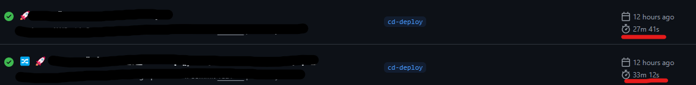
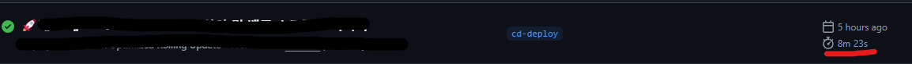

# 📒개발 노트: CI/CD 전략 선택 과정

## ▶️목차

* [1. 초기 배포 방식과 문제점](#초기-배포-방식과-문제점)
* [2. 무중단 배포 전략 검토](#무중단-배포-전략-검토)
* [3. 블루/그린 배포 적용](#블루그린-배포-적용)
* [4. AutoScaling 적용](#autoscaling-도입)
* [5. 최종 배포 전략: 롤링 배포로 전환](#최종-배포-전략-롤링-배포로-전환)
* [6. 최종 아키텍처 및 향후 개선 방향](#최종-프로젝트-아키텍처-및-향후-개선-방향)
* [7. 트러블 슈팅](#트러블-슈팅)

## ❓초기 배포 방식과 문제점
처음에는 EC2 인스턴스를 구성하고 Docker를 이용해 컨테이너를 실행한 뒤, SSH를 통해 로컬에서 서버를 업로드하는 방식으로 배포를 진행함 
그러나 이 과정에서 반복되는 수작업과 배포 과정의 비효율성을 느꼈고, 이를 자동화할 방법을 고민하게 됨

### ✅** CI/CD 자동화 도입**
GitHub Actions를 활용하면 배포 프로세스를 자동화할 수 있다는 것을 알게 되었고, 이를 적용함으로써 코드 푸시만으로도 배포가 가능하도록 개선함

그러나 **새로운 문제**가 발생함
- 서버를 업데이트할 때 다운타임이 발생하여 서비스 이용이 중단됨
- 테스트 중인 팀원들에게도 영향을 미쳐 불편함 초래
- 실제 서비스 환경에서는 치명적인 문제로 작용할 가능성이 높음

이러한 문제를 해결하기 위해 **무중단 배포 전략**이 필요하다는 결론을 내림
- [CI 도구 선택 과정](CI,CD/CI도구_선택_과정.md)
---

## ✳️무중단 배포 전략 검토

**⭐CD(Continuous Deployment)를 위한 대표적인 배포 전략**

| 배포 전략 | 장점 | 단점 |
|-----------|------|------|
| **블루/그린 배포** | 무중단 배포 가능, 롤백이 용이, 실제 프로덕션과 동일한 환경에서 테스트 가능 | 리소스 비용 증가, 설정 복잡성 |
| **롤링 배포** | 리소스 절약, 점진적 변경으로 안정성 확보, 비교적 간단한 구현 | 배포 중 일부 서버의 성능 저하 가능, 버전 호환성 문제 발생 가능성 |
| **카나리 배포** | 특정 사용자 그룹에게만 배포하여 위험 최소화, 실제 사용자 피드백 반영 가능 | 트래픽 라우팅 로직이 필요, 모니터링 부담 증가, 배포 완료까지 시간 소요 |




---

## ☑️블루/그린 배포 적용

### **❇️초기 단계에서 블루/그린 배포 도입**
AutoScaling으로 인스턴스를 관리하지 않았기 때문에, Blue/Green으로도 충분하다고 생각했다. 또한 Blue/Green은 오류
발생 시에도 롤백이 쉽다는 장점을 갖고 있다. 따라서 Blue/green 배포 전략을 도입하기로 했다.
- 기존 인스턴스를 두 개로 나누어 블루/그린 환경을 구축
- 새 버전을 배포할 때, 기존 인스턴스(블루)는 그대로 유지하고 새로운 인스턴스(그린)에서 실행 후 정상 작동을 확인한 뒤 트래픽을 전환
- 문제 발생 시 즉시 롤백 가능

#### ✅ 장점
- 완벽한 무중단 배포
- 롤백이 간편하여 안정성 확보

#### ❌ 단점
- **AutoScaling 적용 시 인스턴스 낭비 문제**
    - 블루/그린 각각 두 개의 인스턴스를 운영하다 보니 필요 이상의 리소스를 소비함
    - 사용하지 않는 버전의 인스턴스를 2개 이상 유지해야 하기 때문에 비용 부담 증가
---

## ☑️AutoScaling 도입

AutoScaling을 도입하여 트래픽 증가 시 자동으로 인스턴스를 확장하도록 구성했다.  
하지만 블루/그린 배포와 AutoScaling이 함께 동작하면서 다음과 같은 **문제점**이 발생함

- ❗**인스턴스가 증가할 때 블루/그린 배포의 버전 관리 어려움**
    - 새로 추가된 인스턴스가 어느 버전에 속해야 하는지 불분명
    - AutoScaling으로 인해 블루/그린이 2개씩 존재하는 상황이 발생

- ❗**환경 변수 관리 이슈**
    - 인스턴스가 새로 생성될 때 환경 변수를 어떻게 설정할지 고민
    - GitHub Actions에서 환경 변수를 가져오는 것이 어려웠고, pem 파일을 이용한 접근도 불가능

### ✅**해결 방법**
- 환경 변수 파일을 **S3에 저장**하고, 새 인스턴스가 부팅될 때 이를 가져오도록 구성
- 보안 강화를 위해 S3를 **퍼블릭 액세스 없이** 설정
- AutoScaling 시작 템플릿을 활용하여 인스턴스가 항상 일관된 상태로 배포되도록 조정

```java
#!/bin/bash
# 기본 세팅 (Docker, AWS CLI 설치 등)
# Docker 저장소 추가, 서비스 시작 및 활성화
# ubuntu 사용자를 Docker 그룹에 추가
# 필요한 파일 및 환경 설정
# 변수 설정
# ECR 로그인 및 S3에서 설정 파일 다운로드
aws s3 cp s3://${S3_BUCKET_NAME}/${S3_COMPOSE_KEY} ${TAPTOON_DIR}/docker-compose.yml
aws s3 cp s3://${S3_BUCKET_NAME}/${S3_APP_CONFIG_KEY} ${CONFIG_DIR}/application-deploy.yaml
# Docker 네트워크 생성
# Docker Compose 실행        

```

---

## ✳️최종 배포 전략: 롤링 배포로 전환

AutoScaling을 도입한 후, **롤링 배포(Rolling Deployment) 전략이 더 적합**하다고 생각함
### ❓**선택 이유**
1. **AutoScaling과 자연스럽게 연동 가능**
    - 블루/그린처럼 불필요한 인스턴스 낭비 없이 **점진적 배포 가능**
    - 새로운 버전이 하나의 인스턴스에 적용된 후, 정상적으로 동작하면 다른 인스턴스에도 순차적으로 배포

2. **리소스 비용 절감**
    - 추가적인 인스턴스 운영 비용 없이 배포 가능
    - 불필요한 환경 구성을 줄이고, 인프라 효율성 향상

3. **서비스 안정성 확보**
    - 하나의 인스턴스를 업데이트할 때 다른 인스턴스는 계속 동작
    - 문제가 발생하면 특정 인스턴스만 롤백하면 되므로 **빠른 복구 가능**
    - s3에 스냅샷 환경 설정과 ECR에 이미지가 저장되므로 롤백도 용이함

---

## 🚩최종 프로젝트 아키텍처 및 향후 개선 방향

### 💠최종 프로젝트 아키텍처


### 🔆향후 개선 방향

현재는 **AutoScaling을 적용한 롤링 배포(Rolling Deployment)** 전략을 사용하고 있으며,  
추후 **ECS, EKS 같은 컨테이너 기반 오케스트레이션 도입도 고려**할 수 있음

- 현재는 EC2 기반이지만, **ECS를 활용하면 컨테이너 단위 배포가 가능**
- **EKS(Kubernetes)를 도입하면, 트래픽 관리 및 오토스케일링 최적화 가능**
- 점진적으로 컨테이너 기반 인프라로 전환하며 배포 전략을 더욱 고도화할 계획

## 🏹트러블 슈팅
### 🔥AWS의 설정 변경 커밋 완료 후 버전이 바뀜에도 커밋 내용이 반영되지 않는 문제
시작 템플릿을 수정하는 과정에서 수정을 시도했지만 반영이 안됨. 버전만 올라감
-> 정확한 원인을 파악하기는 어렵지만, 브라우저의 캐시 문제가 아닐까 생각한다. 시크릿 탭으로 시도하니까 바로 해결되었음.

### 🔥CORS와 권한 설정 문제
클라이언트와 인프라를 통해 통신을 하려다 보니 생각보다 많은 권한과 CORS 문제에 직면함

-> 사용하려는 서비스와 인/아웃바운드 포트 및 vpc, 보안 영역을 맞춰 주고, Application 에서 
Security CORS 허용을 해주어야 함

### 🔥배포 시간 단축 여정
배포 시간이 30분 내외로 소요되던 문제가 있었음


#### 🚨기존 GitActions 무중단 배포 파이프라인의 문제점
- 지나치게 보수적인 롤링 업데이트 설정(MinHealthyPercentage: 100%)으로 한 번에 하나의 인스턴스만 교체 가능
- 불필요하게 긴 인스턴스 준비 대기 시간(InstanceWarmup: 180초)
- 고정된 대기 시간(sleep 180초 + 120초)으로 인한 불필요한 지연
- 전체 배포 완료(100%)를 기다리는 비효율적인 워크플로우 종료 조건
- Docker 빌드 및 이미지 푸시 과정의 캐싱 최적화 부족
- 병렬 처리 없는 빌드 및 헬스 체크로 인한 속도 저하
- 배포 진행 상황 모니터링을 위한 효율적인 체크포인트 부재
```java
# 기존 롤링 업데이트 설정 (매우 보수적)
aws autoscaling start-instance-refresh \
  --auto-scaling-group-name "asg-taptoon" \
  --strategy "Rolling" \
  --preferences '{
    "MinHealthyPercentage": 100,
    "InstanceWarmup": 180,
    "MaxHealthyPercentage": 110
  }'
```
#### ✨최적화를 전략✨
1. ⚡ 롤링 업데이트 전략 최적화
   - MinHealthyPercentage 100% -> 50%로 감소: 인스턴스 교체가 더 많이 되어 병렬로 진행
   - InstanceWarmup: 180초 -> 60초로 감소: 각 인스턴스의 고정 대기 시간을 1/3로 줄임
   - MaxHealthyPercentage: 110%에서 150%로 변경: 더 많은 새 인스턴스를 동시에 준비 가능
   - CheckpointDelay: 30초에서 10초로 감소: 체크포인트 간 대기 시간 단축

```java
# 최적화된 롤링 업데이트 설정 - 더 공격적인 배포 전략
PREFERENCES=$(cat <<-EOF
{
  "MinHealthyPercentage": 50,
  "InstanceWarmup": 60,
  "MaxHealthyPercentage": 150,
  "CheckpointPercentages": [25, 50, 100],
  "CheckpointDelay": 10
}
EOF
)

aws autoscaling start-instance-refresh \
  --auto-scaling-group-name "asg-taptoon" \
  --strategy "Rolling" \
  --preferences "$PREFERENCES"
```

2. ⚡ 대기 시간 및 체크포인트 최적화
   - 고정 대기 시간 제거: 인스턴스를 위한 대기시간 5분 제거
   - 일찍 완료 처리: 배포의 25%만 완료되면 워크플로우를 성공으로 간주, 나머지는 백그라운드 진행<br>
     ➡️ 1개의 인스턴스만 완료하면 그 인스턴스에 트래픽을 몰아 주고, 나머지 인스턴스들이 완료되는 대로 트래픽 분산
   - 체크포인트 도입: [25%, 50%, 100%] 지점에서 진행 상황을 확인하는 체크포인트 기능 추가
   - 체크포인트 타임아웃 단축: 25분에서 5분으로 감소하여 빠른 피드백 제공

```java
# 25% 체크포인트만 확인하고 일찍 완료 처리
echo "첫 번째 체크포인트(25%)까지 모니터링 시작..."
CHECKPOINT_TIMEOUT=300  # 5분

while [ $(($(date +%s) - START_TIME)) -lt $CHECKPOINT_TIMEOUT ]; do
  # 체크포인트 확인
  CHECKPOINT=$(aws autoscaling describe-instance-refreshes \
    --auto-scaling-group-name "asg-taptoon" \
    --instance-refresh-ids $REFRESH_ID \
    --query "InstanceRefreshes[0].ReachedCheckpoints[*].CheckpointPercentage" \
    --output text 2>/dev/null || echo "")
  
  # 첫 번째 체크포인트(25%)에 도달하면 성공으로 간주하고 종료
  if [[ "$CHECKPOINT" == *"25"* ]]; then
    echo "✅ 첫 번째 체크포인트(25%)에 도달했습니다!"
    break
  fi
  
  sleep 10
done
```

3. ⚡ 빌드 및 헬스 체크 최적화
   - 병렬 빌드: Gradle --parallel --build-cache 옵션 추가로 빌드 속도 향상
   - Docker 빌드 최적화: 캐싱 메커니즘 개선 및 불필요한 레이어 최소화
   - 더 효율적인 헬스 체크: 최소 30%의 인스턴스만 정상이면 성공으로 간주
   - 헬스 체크 재시도 로직 개선: 실패 시 3회까지 재시도하여 일시적 네트워크 이슈 대응
   - 에러 처리 강화: 배포 및 이미지 태그 생성 과정의 오류 처리 개선으로 파이프라인 안정성 향상
```java
# 기존 빌드 명령
- name: Build with Gradle
  uses: gradle/gradle-build-action@v2
  with:
    arguments: build -x test

# 최적화된 병렬 빌드 명령
- name: Build with Gradle
  uses: gradle/gradle-build-action@v2
  with:
    arguments: build -x test --parallel --build-cache
```

```java
# 개선된 헬스 체크 로직
for INSTANCE_ID in $(echo "$INSTANCES" | jq -r '.[]'); do
  # IP 주소 가져오기
  IP=$(aws ec2 describe-instances \
    --instance-ids $INSTANCE_ID \
    --query "Reservations[0].Instances[0].PublicIpAddress" \
    --output text)
  
  if [ -z "$IP" ] || [ "$IP" == "null" ]; then
    echo "⚠️ 인스턴스 $INSTANCE_ID에 공용 IP가 없음"
    continue
  fi
  
  echo "인스턴스 $INSTANCE_ID ($IP) 헬스 체크 중..."
  HEALTH=$(curl -s --connect-timeout 3 --max-time 5 "http://$IP:8080/health" || echo "DOWN")
  
  if echo "$HEALTH" | grep -q "UP"; then
    echo "✅ 인스턴스 $INSTANCE_ID ($IP) 정상"
    HEALTHY_INSTANCES=$((HEALTHY_INSTANCES + 1))
  else
    # 두 번 더 시도 (재시도 로직 추가)
    for i in {2..3}; do
      echo "재시도 $i/3..."
      sleep 2
      HEALTH=$(curl -s --connect-timeout 3 --max-time 5 "http://$IP:8080/health" || echo "DOWN")
      
      if echo "$HEALTH" | grep -q "UP"; then
        echo "✅ 인스턴스 $INSTANCE_ID ($IP) 정상 (재시도 $i에서 성공)"
        HEALTHY_INSTANCES=$((HEALTHY_INSTANCES + 1))
        break
      fi
    done
  fi
done
```

#### 🚩성능 개선 결과
원래 배포: 약 30분 (고정 대기 시간 5분 + 배포 완료까지 ~25분)
최적화된 배포: 약 5-8분 (빌드 ~2-3분 + 25% 체크포인트 도달 ~2-3분 + 헬스 체크/마무리 ~1-2분)

가장 큰 변화는 전체 배포가 아닌 일부(25%)만 완료되면 워크플로우를 종료하는 방식으로, AWS에서 나머지 배포는 백그라운드로 계속 진행됨
➡️ 워크플로우 실행 시간과 실제 배포 완료 시간을 분리하여 개발자 경험을 크게 향상시킴

결과적으로 GitActions CD 파이프라인의 실행 시간을 약 30분에서 5-8분으로 단축하여 개발 생산성을 크게 향상시킴



---

[ReadMe로 돌아가기](../../README.md)