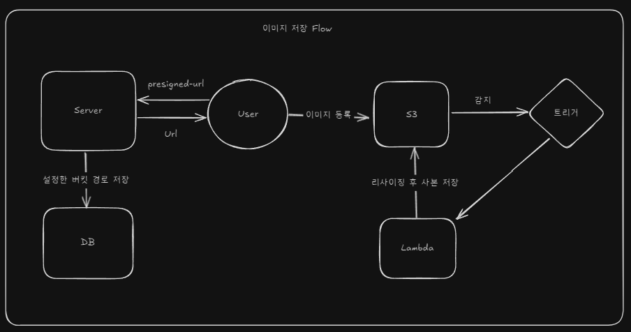
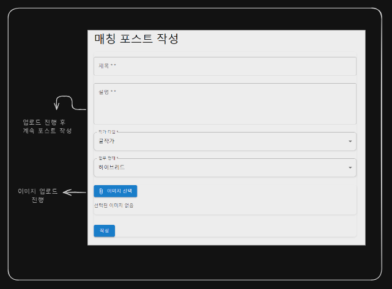
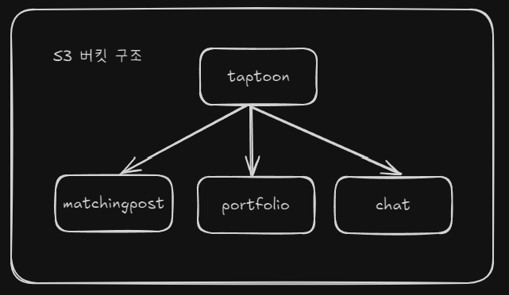
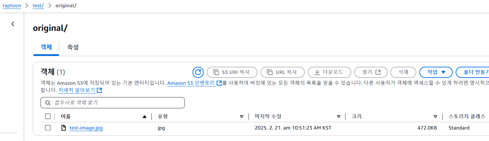
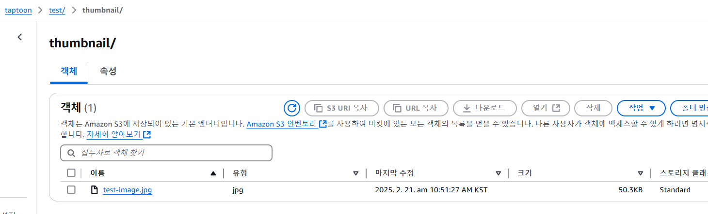

# 개발노트: 이미지 저장 및 관리 전략

## 목차

* [1. 이미지 저장 방식 비교 분석](#이미지-저장-방식-비교-분석)
    - 업로드 방식 비교
    - 현재 프로젝트 상황
    - 각 방식이 프로젝트에 미치는 영향
    - 결론
* [2. 이미지 리사이징 구현 전략](#이미지-리사이징-구현-전략)
    - 구현 방식
    - 구현 방식 분석
    - 현재 프로젝트 상황
    - 결론
* [3. AWS Lambda 언어 선택 과정](#aws-lambda-언어-선택-과정)
* [4. 트러블슈팅](#트러블슈팅)
    - 이미지 리사이징 문제 해결
    - 람다 트리거 설정 문제 해결 
* [5. 고아 객체 정리 프로세스(미완)]()

---
## preview(이미지 저장 흐름)

## 이미지 저장 방식 비교 분석
### 업로드 방식 비교
| 방식 | 장점 | 단점 |
|------|------|------|
| **MultiPart** | 대용량 파일 업로드 가능, 진행 상황 추적 용이, 부분 재시도 가능 | 작은 파일에는 오버스펙, 서버 리소스 소모 큼 |
| **Stream** | 실시간 처리 가능, 구현이 단순함 | 네트워크 장애 시 복구 불가, 대용량 파일 처리에 부적합 |
| **PreSignedUrl** | 서버 부담 적음, 속도 빠름, 보안성 높음 | 진행 상황 추적 어려움, 대용량 파일 안정성 저하 |

### 현재 프로젝트 상황
- 이미지 크기: 최대 30MB, 평균 10MB
- 한 번에 최대 5개 이미지 업로드 가능 (확장 가능성 있음)
- 서비스 특성상 업로드된 이미지의 장기 보존이 중요

### 각 방식이 프로젝트에 미치는 영향
- **MultiPart**: 서버가 업로드 전 과정을 관리해야 하므로 트래픽 증가 시 서버 부하 증가
- **Stream**: 네트워크 장애 시 복구 불가능 → 이미지 처리의 신뢰성이 낮음
- **PreSignedUrl**: 클라이언트가 S3와 직접 통신 → 서버 부담 감소

### 결론: **PreSignedUrl 방식 채택**
- 클라이언트가 S3와 직접 통신하여 분산 처리 가능 → 서버 부담 감소
- 이미지 업로드를 비동기적으로(클라이언트에서) 처리해 사용자 경험 개선
- 고아 객체 관리가 필요하지만, 스케줄러 기반 정리 프로세스로 해결 가능

**➡️사용자는 이미지 업로드를 눌러 놓은 채 게시글 작성을 이어나갈 수 있다**
### 버킷 구성 전략
| 방식 | 장점 | 단점                     |
|------|------|------------------------|
| **하나의 버킷, 디렉터리 관리** | 관리 용이, 보안 정책 적용 용이 | 서비스 규모 확대 시 디렉터리 관리 복잡 |
| **도메인별 별도 버킷 관리** | 개별 정책 적용 가능, 데이터 격리 용이 | 	관리 및 비용 부담 증가         |

#### 선택: **하나의 버킷을 생성한 후 디렉터리로 구분**
- 도메인별 별도 보안 정책이 필요하지 않음
- 관리가 용이하고 비용이 적게 듦
- 추후 필요 시 확장 가능

---

## 이미지 리사이징 구현 전략
### 이미지 리사이징의 필요성
- 대용량 원본 이미지를 그대로 서비스에 제공할 경우, 데이터 전송량이 증가해 성능 저하와 불필요한 
네트워크 비용을 초래할 수 있다.
- 특히, 사용자 화면에 보여지는 썸네일 이미지의 경우 원본 이미지에 비해 크기가 약 10배 이상 작아질 수 있으며,
리사이징 후에도 시각적으로 큰 품질 저하 없이 충분히 식별이 가능하다.

따라서, 이미지 리사이징을 통해 서비스 성능을 개선하고 사용자 경험(UX)을 향상시키고자 한다.
또한, 원본 이미지는 별도로 저장하여 필요 시 원본 다운로드가 가능하도록 구현할 계획이다.

(원본 이미지 - 472KB)

(리사이징 이미지 - 50KB)

위와 같은 방식으로 데이터 전송량을 획기적으로 줄일 수 있으며, 
서비스 응답 속도 개선과 네트워크 비용 절감 효과를 기대할 수 있다.

### 구현 방식 비교
| 방식 | 장점 | 단점 |
| ------| ------| ------|
|서버 리사이징 후 저장|리사이징 품질 및 일관성 확보|PreSigned URL 방식과 구조적으로 맞지 않음|
|클라이언트 리사이징|서버 부담 최소화|디바이스 환경별 품질 차이, 보안 취약성, 불법 콘텐츠 탐지 어려움|
|S3 업로드 후 Lambda 리사이징|서버리스 구성으로 비용 절감, 자동 확장성 우수, 품질 일관성 확보|Lambda 실행 시간 및 메모리 제한 고려 필요|

### 현재 프로젝트 상황
- PreSignedUrl 방식이므로 서버에서 리사이징하는 것은 부적합함
- 클라이언트 환경 다양성 및 보안 문제로 클라이언트 리사이징 방식 부적합
- 별도의 리사이징 서버를 두기엔 비용 낭비가 우려됨

### 결론: **Lambda를 활용한 서버리스 구조 채택**
- 업로드 이벤트 자동 감지 및 리사이징 실행
- 서버리스 환경으로 비용 절감 및 유연한 확장성 확보
- 원본 및 리사이징 이미지를 별도 경로 저장해 원본 보존 및 서비스 최적화 동시 달성

---
## AWS Lambda 언어 선택 과정
### 핵심 고려 사항
- Lambda는 짧은 시간 내 실행 완료 및 빠른 Cold Start 필요
- 현재 서비스는 Spring 기반이지만, Lambda에서 Spring 사용 시 구동 시간 및 메모리 사용량 과다 -> 무거움
- 러닝 커브도 함께 고려(Node.js, Python)

### Lambda 언어 비교 분석
| 언어| 특징                                                 |
|------|----------------------------------------------------|
|Java| - 기존 서비스와 동일한 언어, - 구동 속도 느림,  - 메모리 사용량 큼 |
|Node.js| - 빠른 실행 속도 - 통신 환경에 적합                         |
|Python| - 빠른 실행 속도 -  Pillow 등 이미지 처리 라이브러리 풍부         |

### 선택: **Python**
현재 Lambda의 핵심 역할은 "이미지 리사이징 후 저장"이다.
핵심 로직이 데이터 처리에 집중되므로 Python이 가장 적합하다고 생각했다.

---
## 트러블슈팅
### 1. 이미지 리사이징 문제 해결
**문제:** Lambda에서 `PIL` 라이브러리를 가져올 수 없는 오류 발생

**원인 분석 및 해결 과정:**
- Lambda 기본 런타임 환경에 Pillow 미포함
- 로컬 가상환경에서 라이브러리 패키징해 배포 시 Lambda 환경과 호환 문제 발생
- AWS Lambda Layer로 공식 제공되는 Pillow 라이브러리 활용해 해결
- Python 3.13에서 호환성 문제 발견 → Python 3.9로 다운그레이드해 최종 해결

### 2. 람다 트리거 설정 문제 해결
**문제:** 특정 디렉터리 업로드 시 Lambda 트리거 미작동

**해결 과정:**
- S3 버킷의 정책 및 IAM 설정 수정 → 여전히 해결되지 않음
- S3 이벤트 알림을 추가하려 했으나 실패
- **해결:**
    - 연결된 SQS가 없는 S3 이벤트를 삭제한 후 트리거 정상 작동
    - 원인: 존재하지 않는 SQS가 설정된 상태에서 버킷 이벤트를 수정하려 하면 실패함

---

## 마무리
이번 정리를 통해 이미지 저장 및 관리 전략을 체계적으로 수립하고, 
Lambda 기반의 서버리스 이미지 리사이징 방식을 적용하여 비용 절감과 성능 향상을 달성했다. 
향후 확장성과 유지보수성을 고려하여 개선할 부분을 지속적으로 점검할 예정이다.

---
[개발노트로 돌아가기](../개발노트.md)