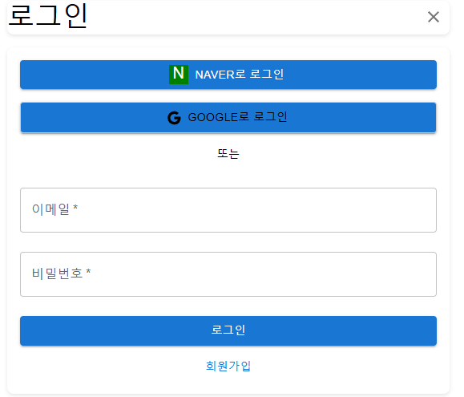

# 📝 개발 노트: 인증 및 인가 전략

## 목차
* [1. 인증 및 인가 개요](#인증-및-인가-개요)
* [2. 회원 인증 흐름](#회원-인증-흐름)
* [3. 토큰 인증 흐름](#토큰-인증-흐름)
* [4. 고려해야 할 보안 이슈](#고려해야-할-보안-이슈)
* [5. Refresh Token 관리 정책](#refresh-token-관리-정책)
   - Refresh Token 저장 방식 비교
   - 선택한 방식 및 근거
* [6. Refresh Token 전송 방법](#refresh-token-전송-방법)
   - 전송 방식 비교
   - 결론
* [7. SecretKey 관리 정책](#secretkey-관리-정책)
* [8. 웹 통신 클라이언트 선택 과정](#웹-통신-클라이언트-선택-과정)
* [9. OpenFeign 트러블슈팅](#openfeign-트러블슈팅)

---

## 🚀인증 및 인가 개요
애플리케이션의 기능만큼 중요한 것이 **인증(Authentication)**과 **인가(Authorization)**이다.  
사용자가 작성한 글을 다른 사람이 무단으로 수정하거나 삭제할 수 있다면, 이는 애플리케이션의 신뢰를 무너뜨리는 지름길이다. 
이를 방지하기 위해서는 철저한 인증/인가 전략이 필수적이다.  
먼저, 인증 흐름부터 살펴보겠다.

---

## 🔑회원 인증 흐름
1. 사용자가 회원 정보로 로그인을 시도
2. **Spring Security**와 토큰 검증을 통해 인증이 완료
3. 인증된 사용자는 서비스를 이용할 수 있음
4. 로그아웃 시, **Refresh Token을 파기**



---

## 🔄토큰 인증 흐름
1. 로그인 성공 시 서버는 **Refresh Token**과 **Access Token**을 발급
2. 사용자는 Access Token의 유효 기간 동안 서비스를 이용
3. Access Token이 만료되면, Refresh Token을 사용해 재발급을 요청
4. 서버는 저장된 Refresh Token과 요청된 토큰을 비교 검증
5. 검증이 완료되면 새로운 Access Token을 발급
6. 로그아웃 시, Refresh Token을 즉시 파기

---

## ⚠️고려해야 할 보안 이슈
- 애플리케이션 보안의 핵심은 **토큰 발급과 검증**에 있음
- 토큰은 위조가 불가능하다는 전제하에 동작하며, 포함된 정보가 유효하고 안전하게 검증되어야 함 
- 특히, Access Token 재발급에 사용되는 **Refresh Token의 관리**는 보안의 중요한 요소임

그럼, 이것을 어떻게 안전하게 관리할지 고민해보자.

---

## 🔒Refresh Token 관리 정책

### 💠Refresh Token 저장 방식 비교

| 저장 방식 | 장점  | 단점  |
|---------|------|------|
| **Redis 저장** | • DB 조회 없이 빠른 토큰 관리 가능<br>• TTL(Time-To-Live) 설정으로 만료된 토큰 자동 삭제<br>• 메모리 기반으로 빠른 읽기/쓰기 성능 | • 단일 Redis 서버 장애 시 데이터 유실 위험<br>• 다중 도메인 사용 시 용량 제한으로 비용 증가 가능<br>• 메모리 기반으로 영구 저장에 제한 |
| **관계형 DB 저장** | • 데이터 일관성과 영속성 보장<br>• Redis 대비 비용 부담 적음<br>• 기존 DB 인프라 활용 가능 | • Redis보다 접근 속도 느림<br>• 만료된 토큰 삭제를 위한 추가 로직 필요<br>• 별도의 인덱싱 관리 필요 |

### 🚩선택한 방식 및 근거
초기 서버 설계에서는 고려하지 못했던 문제였으나, **무중단 배포와 서버 안정성 확보** 후 재검토함
**AWS ElastiCache를 활용한 Redis 클러스터링**으로 데이터 일관성을 유지하며, 빠른 조회 성능과 TTL 기반 자동 만료를 지원함  
따라서 **Redis를 Refresh Token 저장소로 선택**

---

## 📤Refresh Token 전송 방법

### 💠전송 방식 비교

| 전송 방식 | 장점  | 단점  |
|---------|------|------|
| **Body에 담기** | • 구현이 간단하고 직관적 | • 브라우저 캐시에 남을 가능성 있음<br>• **CSRF, XSS 공격에 취약** |
| **헤더에 담기** | • REST 아키텍처와 일관성 유지<br>• 보안성 향상 | • Authorization 헤더 사용 시 Access Token과 혼동 가능<br>• **커스텀 헤더 관리 필요** |
| **쿠키에 담기** | • HttpOnly 설정으로 XSS 방어 가능<br>• 자동 전송으로 개발 편의성 증가 | • **CORS 설정 복잡, 모바일 환경 제약 가능**<br>• SameSite 정책 고려 필요 |

### 🔆결론
- **헤더 전송 방식**을 선택 
- 보편적이고 간편하며, **Authorization 대신 `Refresh-Token` 커스텀 헤더**를 사용해 혼동을 방지
- REST API 기반 통신에서 일관된 패턴을 유지할 수 있다는 장점

---

## 🗝️SecretKey 관리 정책

### 🚨문제 상황
JWT SecretKey의 관리를 소홀히 하게 되면, 유출 시 치명적인 보안 이슈가 발생한다.  
SecretKey는 토큰 발급의 핵심이므로, 이를 안전하게 관리하는 방안을 고민했다.

### 💠대안 분석

| 관리 방식 | 설명 | 장점  | 단점  |
|---------|-----|------|------|
| **서버 재시작 시 갱신** | `UUID.randomUUID()`로 SecretKey를 동적 생성 | • yml 파일 관리 불필요<br>• 자주 바뀌는 환경에서 보안 강화 | • 무중단 배포(CD) 환경에서는 비효율적<br>• 재시작 시 이전 토큰 무효화 |
| **스케줄러로 주기적 갱신** | 주기적으로 SecretKey 변경 및 갱신 | • 유출되어도 제한된 시간만 유효 | • 분산 서버 환경에서 동기화 비용 증가<br>• 구현 복잡도 상승 |
| **Git Secrets에 저장** | 환경 변수를 Git에 암호화하여 저장 | • 기존 CI/CD 파이프라인과 통합 용이 | • 인적 실수로 인한 유출 위험<br>• 접근 권한 관리 필요 |
| **EC2 환경 변수 저장** | EC2 인스턴스에 직접 환경변수로 저장 | • 코드와 설정 분리 | • 다중 서버 환경에서 일관성 유지 어려움<br>• 인스턴스 교체 시 재설정 필요 |
| **AWS Secrets Manager 활용** | AWS 서비스를 통한 암호 관리 | • AWS 보안에 의존, 높은 안정성<br>• 자동 교체 지원 | • 추가 비용 발생<br>• API 호출 지연 |

### 🚩결론
**Git Secrets와 AWS S3 조합**을 선택
- Git Secrets에 AWS 민감 정보를 저장
- `application.yml`을 S3에 업로드 후 권한 설정으로 접근 제어
- **근거**:
   - AWS Secrets Manager 비용 절감
   - 분산 저장으로 보안 강화
   - SecretKey 동기화 없이 S3 업로드로 관리 가능
   - 기존 CI/CD 파이프라인과 통합 용이

---

## 🌐웹 통신 클라이언트 선택 과정
OAuth 구현 중 네이버의 Callback API와 통신하기 위해 웹 클라이언트를 선택했다.  
`RestTemplate`은 Spring에서 더 이상 권장하지 않으므로, 최신 대안들을 비교했다.

### 💠각 기술 비교

| 클라이언트 | 장점  | 단점  |   
|---------|------|------|
| **WebClient** | • 비동기 처리 특화, WebFlux와 호환성 우수<br>• 최신 Spring 기술 스택과 일관성 | • 의존성 추가로 프로젝트 무거워짐<br>• 러닝 커브가 상대적으로 높음 |
| **RestTemplate/HttpClient** | • 간단한 사용법과 익숙한 API<br>• 기존 코드베이스와 호환성 | • Deprecated 예정, 향후 지원 불확실<br>• 비동기 처리를 위한 추가 설정 필요 |
| **OkHttp** | • 성능 우수, 효율적인 캐시 지원<br>• 모바일 환경에서도 안정적 동작 | • Spring 프레임워크와의 통합 설정 필요<br>• 커스텀 설정 작업 필요 |
| **OpenFeign** | • 선언적이고 간결한 코드, Spring Cloud와 호환성<br>• 인터페이스 기반으로 테스트 용이 | • 복잡한 요청 처리가 상대적으로 어려움<br>• 설정 복잡도 증가 가능성 |

### 🔆의사 결정 과정
- 레거시 방식(`RestTemplate`) 대신 최신 기술을 선택했다.
- 로그인은 동기 처리가 필수이므로, 비동기 특화인 WebClient보다 **OpenFeign**이 적합하다고 생각했다.
- 인터페이스 기반 선언적 방식으로 코드 가독성을 높이고 유지보수를 용이하게 하는 것이 주요 결정 요인이었다.

---

## 🏹OpenFeign 트러블슈팅
WebClient에서 OpenFeign으로 전환하며 발생한 문제를 해결한 과정을 정리했다.

### 🚨문제 상황
WebClient에서는 `MultiValueMap`에 Snake Case로 파라미터를 담아 요청했다.
```java
MultiValueMap<String, String> params = new LinkedMultiValueMap<>();
params.add("grant_type", "authorization_code");
// ... (생략)
NaverTokenResponse response = webClient.post()
    .uri(tokenRequestUrl)
    .bodyValue(params)
    .retrieve()
    .bodyToMono(NaverTokenResponse.class)
    .block();
```

OpenFeign으로 전환 후 `@SpringQueryMap`을 사용했으나, Snake Case 변환이 되지 않아 오류가 발생했다.
```java
@FeignClient(name = "naverAuth", url = "https://nid.naver.com", configuration = FeignConfig.class)
public interface NaverAuthClient {
    @PostMapping("/oauth2.0/token")
    NaverTokenResponse getAccessToken(@SpringQueryMap NaverTokenRequest request);
}
```

### 🔁해결 과정

#### 1. 로그 확인
- Feign Logger를 FULL로 설정해 요청 파라미터 확인
- 네이버가 요구하는 Snake Case가 적용되지 않는 것을 확인

#### 2. ObjectMapper 추가
- Snake Case 변환을 위한 설정 시도
```java
@Bean
public ObjectMapper objectMapper() {
    ObjectMapper objectMapper = new ObjectMapper();
    objectMapper.setPropertyNamingStrategy(PropertyNamingStrategies.SNAKE_CASE);
    return objectMapper;
}
```
- 하지만 `@RequestParam`에는 적용되지 않는 문제 발견

#### 3. RequestParam 개별 사용
- DTO 대신 개별 파라미터로 전환
```java
NaverTokenResponse getAccessToken(
    @RequestParam("grant_type") String grantType,
    @RequestParam("client_id") String clientId,
    // ... 기타 파라미터
);
```
- 성공적으로 동작하나, 가독성과 유지보수성 저하

#### 4. Default 메서드 도입
- DTO 유지 및 가독성 개선을 위한 인터페이스 default 메서드 활용
```java
@FeignClient(name = "naverAuth", url = "https://nid.naver.com", configuration = FeignConfig.class)
public interface NaverAuthClient {
    @PostMapping("/oauth2.0/token")
    NaverTokenResponse getAccessToken(
        @RequestParam("grant_type") String grantType,
        @RequestParam("client_id") String clientId,
        // ... 기타 파라미터
    );
    
    // 인터페이스 default 메서드로 DTO를 개별 파라미터로 변환
    default NaverTokenResponse getAccessToken(NaverTokenRequest request) {
        return getAccessToken(
            request.grantType(),
            request.clientId(),
            // ... 기타 파라미터
        );
    }
}
```
- `response = naverAuthClient.getAccessToken(request)`로 간결하게 사용 가능
- 내부적으로는 Snake Case 요구사항을 충족하면서 클라이언트 코드의 가독성 유지

---

## 🎆마무리
이번 인증/인가 전략은 보안성과 사용 편의성을 모두 고려한 결과물이다.  
토큰 관리부터 SecretKey 보안까지, 애플리케이션의 신뢰성을 높이기 위한 고민을 담았다.  
이 전략은 현재 필요를 충족하지만, 보안 위협과 기술은 끊임없이 진화한다.  
앞으로도 최신 트렌드를 반영하며 더 견고한 인증/인가 체계를 만들어갈 것이다.  
더 나은 아이디어나 피드백이 있다면 언제든 공유해 주길 바라며, 함께 신뢰할 수 있는 시스템을 구축해 나가고자 한다.

---
[ReadMe로 돌아가기](../../README.md)