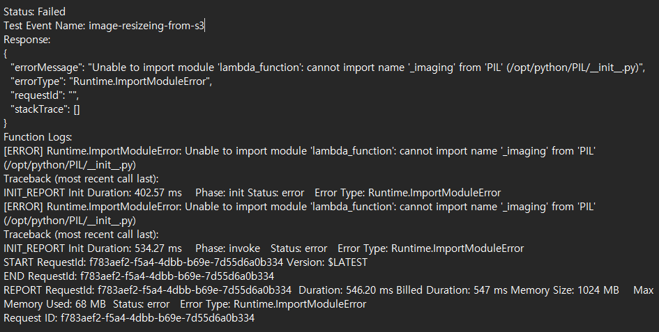

이런 에러 메세지가 출력되었고, 해당 메시지는 람다 함수 내에서 PIL 라이브러리를 가져올 수 없어서 발생하였다.

이를 해결하기 위해 AWS에서 제공하는 Pandas와 같은 라이브러리(PIL을 포함하고 있을 것이라 추정되는)를 
추가해 보았으나 추가 되지 않았다.
가상 파이썬 프로젝트를 로컬에서 만들고, pip를 통해 PIL 라이브러리를 설치 한 후, 
그 파일을 압축해서 가져와 쓰는 방법을 사용해 보았는데, 이조차 호환이 안되는지 작동하지 않았다.

aws에서 공식적으로 지원하는 PIL 라이브러리를 ARN 에서 가져올 수 있었는데, 
이는 python9버전과 호환이 되었다. 따라서 Python9버전으로 함수를 다운그레이드 하고,
해당 ARN을  참조하여 해당 문제를 해결했다. 참고한 사이트는 아래에 링크 해 두었다.

[AWS 지원 ARN 리스트](https://api.klayers.cloud/api/v2/p3.9/layers/latest/ap-northeast-2/html)