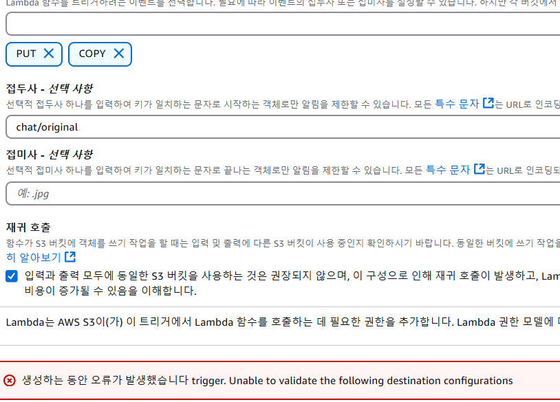
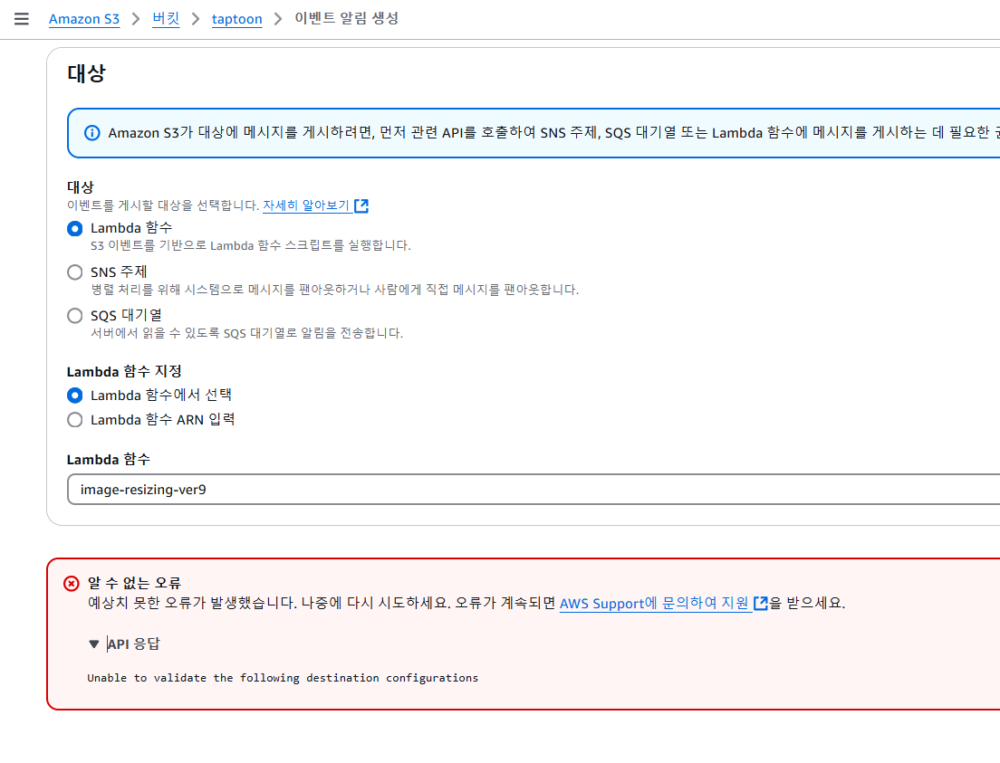
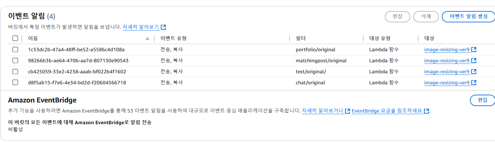

Lambda를 테스트 디렉터리에서 트리거 하는 것은 이미 성공하였다.

하지만, 내가 원하는 것은 test/original → test/thumbnail로 리사이징하는 것이 아닌,

matchingpost/original, chat/original, portfolio/original에서 각각의 thumbnail 폴더로
리사이징 한 사본을 저장하는 것이다.

이를 위해 트리거를 추가하고자 했으나,

이러한 오류와 함께 거부당하고 있고,

이를 해결하기 위해 s3버킷의 정책 설정, IAM 설정 등을 해주었는데… 딱히 먹히지 않는다.

버킷에서 이벤트 알림을 직접 추가하려고 시도도 하고 있는데,

이것 역시 거부당한다.

허무하게도 연결된 SQS가 없는 S3 이벤트를 삭제하니 트리거가 정상적으로 등록이 된다!

S3 버킷에 등록된 S3 이벤트 중 전달 대상으로 설정된 SQS가 실제로 존재하지 않는 경우,

해당 S3 버킷에 등록된 모든 S3 이벤트를 수정할 수 없고 새로 S3 이벤트를 생성할 수도 없어서 발생한 문제였다.

