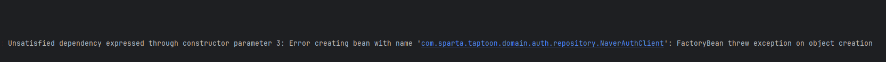
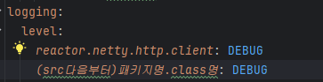
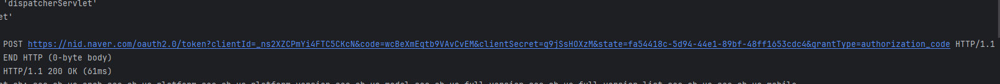

# OpenFeign 트러블 슈팅

프로젝트는 비동기적 흐름이 아닌 동기적 흐름으로 진행되고, 이 흐름에는 WebClient 보다는 
OpenFeign 이 적절할 것이다. 

지금부터 기존에 있던 WebClient 를 OpenFeign 으로 바꾸는 과정에서 발생한 문제 상황과 해결 과정을 기술해 본다.


WebClient 에서 HTTP 요청을 보내기 전에 필요한 정보들을 MultiValueMap<>에 snake_case로 담는다.
```java
MultiValueMap<String, String> params = new LinkedMultiValueMap<>();
params.add("grant_type", "authorization_code");
params.add("client_id", clientId);
params.add("client_secret", clientSecret);
params.add("code", code);
params.add("state", state);

WebClient webClient = WebClient.create();
NaverTokenResponse response = webClient.post()
        .uri(tokenRequestUrl)
        .contentType(MediaType.APPLICATION_FORM_URLENCODED)
        .bodyValue(params)
        .retrieve()
        .bodyToMono(NaverTokenResponse.class)
        .block();
```
요청은 APPLICATION_FORM_URLENCODED 방식으로 진행되기 때문에, Map<> 대신 MultiValueMap<>를 사용한다.

문제는 여기서 OpenFeign으로 바꿀 때 발생한다.
```java

NaverTokenRequest request = NaverTokenRequest.builder()
                .grantType("authorization_code")
                .clientId(clientId)
                .clientSecret(clientSecret)
                .code(code)
                .state(state)
                .build();

        NaverTokenResponse response = naverAuthClient.getAccessToken(request);
```
OpenFeign을 사용하면서 FeignClient 를 사용하게 되고,

```java
@FeignClient(name = "naverAuth", url = "https://nid.naver.com", configuration = FeignConfig.class)
public interface NaverAuthClient {
    @PostMapping("/oauth2.0/token") 
    NaverTokenResponse getAccessToken(@SpringQueryMap NaverTokenRequest request);
}
```

Spring Feign 공식 문서에서 @SpringQueryMap을 권장하길래 써보고자 위와 같이 시도했는데,
다음과 같은 오류와 마주하게 된다.


원인을 분석하고자 로깅을 하려 했는데, 네이버 측으로 요청을 보내는 것이어서 일반적인 Slf4j 등 서버쪽에서
로그를 출력하는 것은 힘든 상황이었다.


```java
@Bean
    Logger.Level feignLoggerLevel() {
        return Logger.Level.FULL;
    }
```


그래서 Feign Config 설정파일에서 로깅을 위한 설정을 해주고, Application.yml파일에도 설정을 다음과 같이
추가 해 주었다.

그 결과 다음과 같은 로그를 얻을 수 있었다.


로그를 보니 쿼리 파라미터로 전달되어야 하는 값들이 모두 스네이크 케이스로 치환되지 않았다.
네이버는 스네이크 케이스로 매핑을 해서 값을 주고받기에 인버팅이 반드시 필요한데,
그래서 Feign Config에 다음과 같은 ObjectMapper를 추가하게 된다.

```java
@Bean
    public ObjectMapper objectMapper() {
        ObjectMapper objectMapper = new ObjectMapper();
        objectMapper.setPropertyNamingStrategy(PropertyNamingStrategies.SNAKE_CASE);
        objectMapper.configure(DeserializationFeature.FAIL_ON_UNKNOWN_PROPERTIES, false);
        return objectMapper;
    }
```

하지만 이것조차 되지 않는다... 왜일까?

이 ObjectMapper는 RequestParam에는 영향을 주지 않는 듯 하다. 따라서 RequestParam으로 
다음과 같이 전달해 보았다.

```java
public interface NaverAuthClient {
    NaverTokenResponse getAccessToken(@RequestParam("grant_type") String grantType,
                                      @RequestParam("client_id") String clientId,
                                      @RequestParam("client_secret") String clientSecret,
                                      @RequestParam("code") String code,
                                      @RequestParam("state") String state);
}
```

```java
public class NaverAuthService {
    ...

NaverTokenResponse response = naverAuthClient.getAccessToken(request.grantType(),request.clientId(),request.clientSecret(),
                request.code(),request.state());
...
}
```
파라미터로 전달하니 네이버에 값이 전달이 잘 되고, OAuth 로그인이 잘 동작한다!


하지만, 이렇게 바꾸니 서비스 로직에서 전달 할 값이 많아 가독성이 좋지 않았다. 따라서 파라미터로 전달하되,
NaverAuthClient에 default 메서드를 사용해보고자 한다.

```java
@FeignClient(name = "naverAuth", url = "https://nid.naver.com", configuration = FeignConfig.class)
public interface NaverAuthClient {
    @PostMapping("/oauth2.0/token")
//    NaverTokenResponse getAccessToken(@SpringQueryMap NaverTokenRequest request);
    NaverTokenResponse getAccessToken(@RequestParam("grant_type") String grantType,
                                      @RequestParam("client_id") String clientId,
                                      @RequestParam("client_secret") String clientSecret,
                                      @RequestParam("code") String code,
                                      @RequestParam("state") String state);

    default NaverTokenResponse getAccessToken( NaverTokenRequest request) {
        return getAccessToken(request.grantType(),request.clientId(),request.clientSecret(),request.code(),request.state());
    };
}

```
이와 같이 사용하니, 이전과 같이 dto에 담아서 전달하는 것이 가능해져서 가독성이 좋아졌다.
```java
NaverTokenResponse response = naverAuthClient.getAccessToken(request);
```
