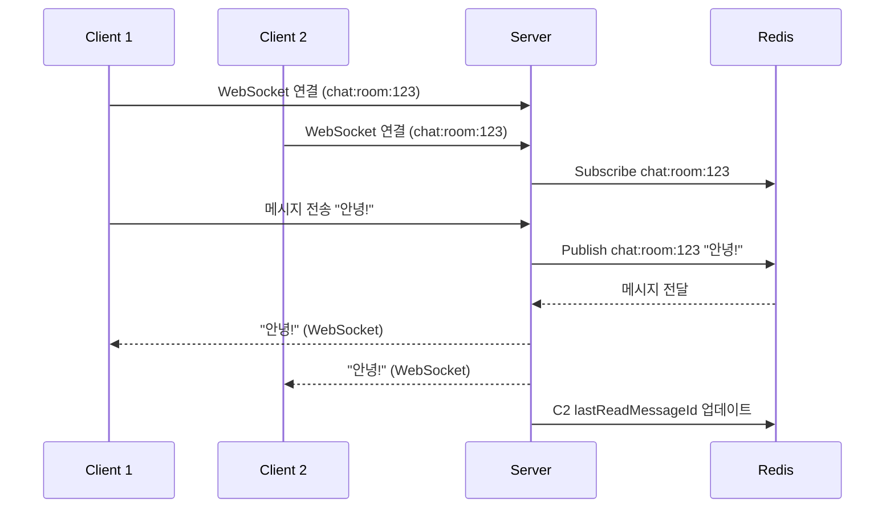

## 프로젝트에서 WebSocket과 Redis(Pub/Sub)의 역할과 흐름

### 1. WebSocket의 역할

WebSocket은 실시간 채팅의 통신 계층을 담당합니다:

- **연결 설정**: 사용자가 채팅방에 입장하면 WebSocket 연결을 통해 서버와 실시간 통신을 시작해요.
- **메시지 전송**: 사용자가 입력한 메시지를 클라이언트에서 서버로 보냅니다.
- **메시지 수신**: 서버가 처리한 메시지를 클라이언트가 받아 화면에 표시해요.

### 2. Redis(Pub/Sub)의 역할

Redis는 메시지 배포와 상태 관리를 책임집니다:

- **Pub/Sub 브로커**: 각 채팅방마다 고유한 채널(예: `chat:room:123`)을 만들어 메시지를 배포.
- **상태 저장**: 사용자의 읽음 상태(`lastReadMessageId`)를 저장해 안 읽은 메시지를 계산.
- **임시 데이터**: 필요 시 메시지를 잠시 저장해 복구나 로그로 활용 가능.

### 3. 전체 흐름

1. **사용자 접속**:
    - 클라이언트가 WebSocket으로 서버에 연결 요청을 보냄.
    - 서버는 사용자를 해당 채팅방의 활성 세션에 추가하고, Redis에서 최신 메시지를 확인해 초기 읽음 상태를 설정.

2. **메시지 전송**:
    - 사용자가 메시지를 입력하면 WebSocket으로 서버에 전송.
    - 서버는 메시지를 Redis의 채팅방 채널에 발행(Publish).

3. **메시지 배포**:
    - Redis는 구독 중인 서버에 메시지를 전달.
    - 서버는 WebSocket으로 채팅방 내 모든 사용자에게 메시지를 브로드캐스트.

4. **읽음 처리**:
    - WebSocket 연결 중인 사용자는 메시지가 도착하면 자동으로 읽음 처리.
    - 서버는 Redis에 `lastReadMessageId`를 업데이트해 상태를 저장.

### 4. 흐름 다이어그램

